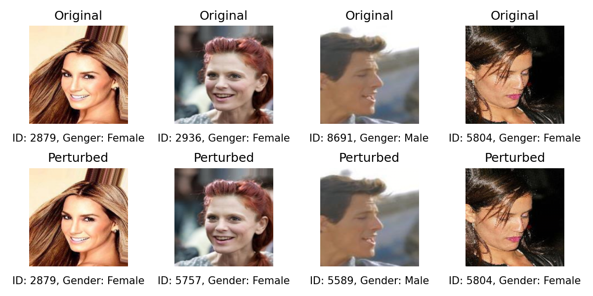

# perturb

> This is a pytorch implementation of perturb, which add noise to images to attack id classifier while keep downstream task available

> [!WARNING]  
> For testing purposes only; accuracy is not guaranteed at this stage. 



## Repo Structure

```
perturb/
 |- data/
   |- faces/
   |- imgs/
   |- attr_celeba.csv
   |- attr_celeba_facenet.csv
 |- libs/
   |- BinaryClassifier.py
   |- CelebADataset.py
   |- DiT.py
   |- SSIMLoss.py
 |- models/
   |- id_model.pth
   |- task_model.pth
   |- noise_model.pth
 |- samples/
   |- comparison.png
 |- util/
   |- data_preparation.py
   |- evaluate_models.py
   |- train_facenet.py
 |- demo.py
 |- evaluate.py
 |- README.md ( This file )
 |- requirements.txt
 |- train.py
```

## Environment

Run commands below to prepare conda environment:

```shell
$ conda create -n perturb python=3.12
$ conda activate perturb
$ pip install -r requirements.txt
```

## Dataset

CelebA Download link: [Baidu NetDisk](https://pan.baidu.com/s/1rCKjFZhh5IzwZnfdUFl7lA?pwd=w37x) [Google Drive](https://drive.google.com/file/d/1Tn_w3Kg2yMMZnfJ_khp0PR9WbGdF_i6O/view?usp=share_link)

### Data Preparation

Since we use facenet-pytorch, which need face to be right in the middle of the image, and the size of image should be 160 * 160, we use MTCNN to proccess the original images.

```shell
$ python utils/data_preparation.py 
```

## Pre-trained models

All pre-trained models were trained on CelebA dataset.

Download link: [Baidu NetDisk](https://pan.baidu.com/s/1FnhqS5mhIBoGSYjzr4hqvg?pwd=134b) [Google Drive](https://drive.google.com/drive/folders/1Ygomk9mUZmaEDaA_NPkLy_QqMQu08W-3?usp=share_link)

## Train

Run commands below:

```shell
$ python train.py
```

If you want to train your own id or downstream task classifier, you shall delete the `.pth` file in `models/` respectively. If id classifier is to be trained, we provide you with a script `train_facenet.py` in `util/`.